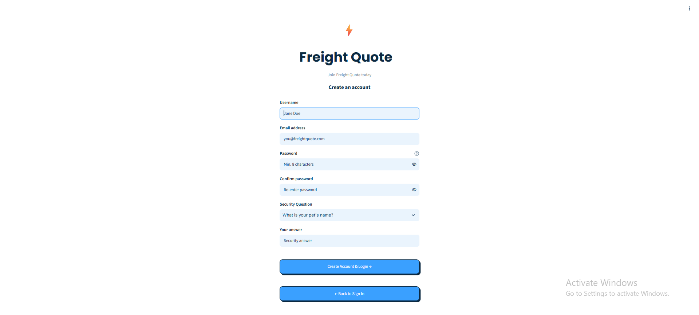
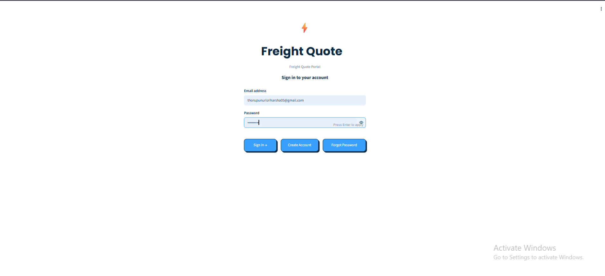
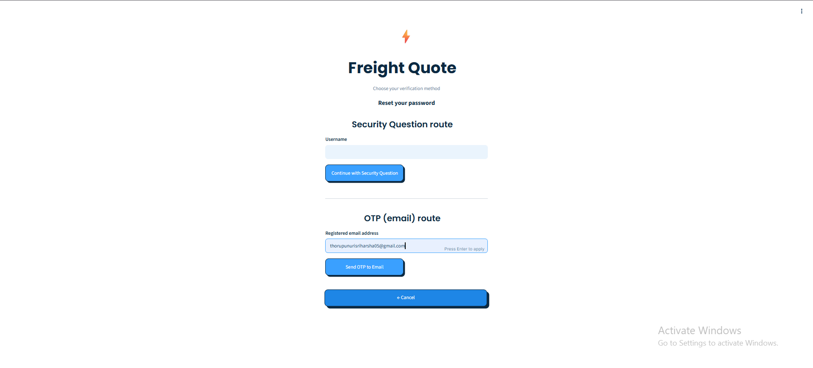
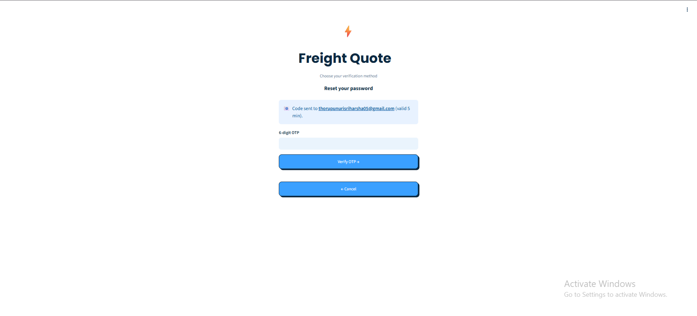
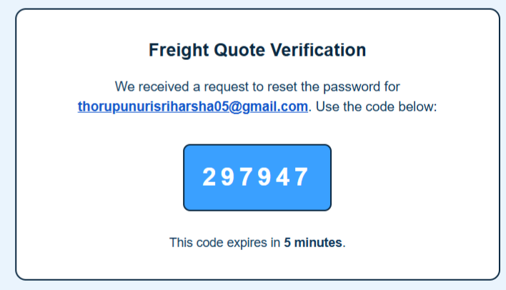
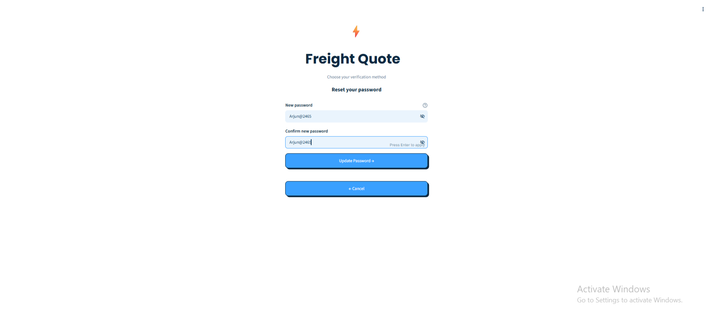
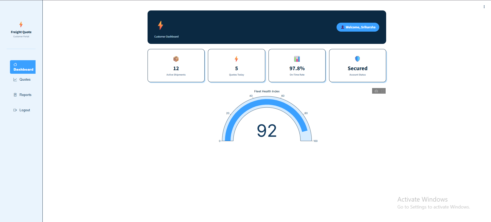

# Intelligent Freight Quote AI
## Milestone 1 – User Authentication Module

## Project Description
The User Authentication Module is a secure web application developed using Streamlit. It provides user registration, login, password recovery using Security Question and Email OTP, JWT-based session management, and separate dashboards for users and administrators. The application focuses on secure authentication, user validation, and access control.

## Features Implemented
- **User Signup** — Allows new users to register by providing a username, email address, password, security question, and security answer with proper input validation.
- **User Login** — Authenticates registered users using their username/email and password before granting access to the application.
- **Forgot Password (Security Question)** — Allows users to securely reset their password by answering the security question selected during registration.
- **Forgot Password (Email OTP)** — Sends a One-Time Password (OTP) to the registered email address for secure password verification and password reset.
- **JWT Session Management** — Generates a secure JSON Web Token (JWT) after successful login to maintain the user's authenticated session and restrict unauthorized access.
- **User Dashboard** — Displays a personalized welcome page after successful user authentication.
- **Admin Dashboard** — Provides a separate administrator login to view the list of registered users without displaying password information.
- **Logout Functionality** — Securely ends the user's session by clearing the JWT token and redirecting to the login page.
- **Password Hashing** — Stores passwords and security answers as hashed values to improve security.
- **Input Validation** — Validates mandatory fields, email format, password strength, and confirm password before processing user requests.

## Technologies Used
| Technology | Purpose |
|---|---|
| Python | Implements the authentication logic and application workflow. |
| Streamlit | Builds the interactive web application interface. |
| SQLite | Stores user registration details securely. |
| JWT | Manages secure user sessions after successful login. |
| bcrypt | Hashes passwords and security answers before storing them. |
| Gmail SMTP | Sends OTP emails for password recovery. |
| ngrok | Generates a public URL to access the application. |
| Google Colab | Development and execution environment for the project. |

## Colab Secrets Used
| Secret Name | Purpose |
|---|---|
| `JWT_SECRET` | Used to sign and verify JWT session tokens. |
| `NGROK_AUTHTOKEN` | Authenticates ngrok to generate a public URL. |
| `EMAIL_ADDRESS` | Gmail account used to send OTP emails. |
| `EMAIL_PASSWORD` | Gmail App Password used for SMTP authentication. |
| `ADMIN_EMAIL` *(optional)* | Admin login email (defaults to `admin@freightquote.com`). |
| `ADMIN_PASSWORD` | Admin login password. |

## How to Run the Project
1. Open the notebook in Google Colab.
2. Configure the required Colab Secrets.
3. Run all notebook cells.
4. Open the generated ngrok URL.
5. Test the Signup, Login, Forgot Password, User Dashboard, and Admin Dashboard.

## How to Generate a Gmail App Password
1. Sign in to your Google account.
2. Enable 2-Step Verification if it is not already enabled.
3. Go to **Google Account → Security → App Passwords**.
4. Select **Mail** as the app.
5. Generate a new App Password.
6. Copy the generated 16-character password.
7. Add it as the value for `EMAIL_PASSWORD` in Google Colab Secrets.

## How to Get an ngrok Authentication Token
1. Create an account on the ngrok website.
2. Log in to your ngrok account.
3. Navigate to the **Your Authtoken** section in the dashboard.
4. Copy your authentication token.
5. Add it as the value for `NGROK_AUTHTOKEN` in Google Colab Secrets.

## Screenshots

### 1. Signup Page

Allows new users to create an account by providing a username, email, password, security question, and security answer.

### 2. Login Page

Allows registered users to securely log in using their email address and password.

### 3. Forgot Password — Choose Verification Method

Lets users pick between resetting their password via the **Security Question** route or the **Email OTP** route.

### 4. Forgot Password — Email OTP Sent

Confirms the OTP has been sent to the registered email and prompts the user to enter the 6-digit code to continue.

### 5. OTP Email Verification

Shows the actual verification email delivered to the user's inbox, containing the 6-digit OTP code and its expiry time.

### 6. Reset Password

Lets the user set and confirm a new password once identity has been verified through either recovery route.

### 7. User Dashboard

Provides users with access to their personalized dashboard and account details after successful login.
