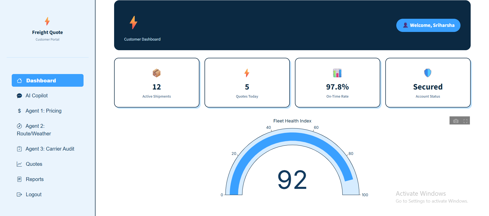
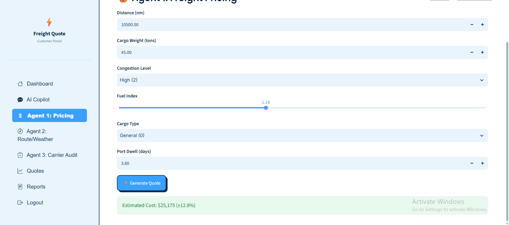
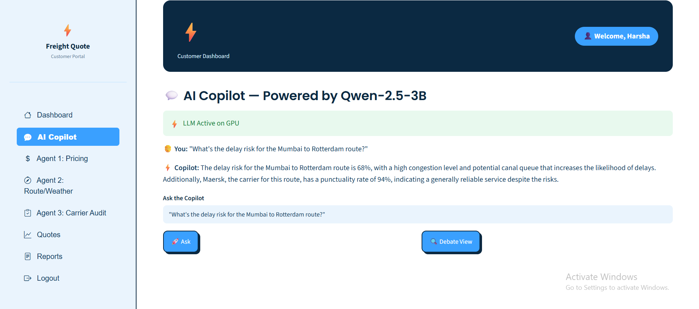
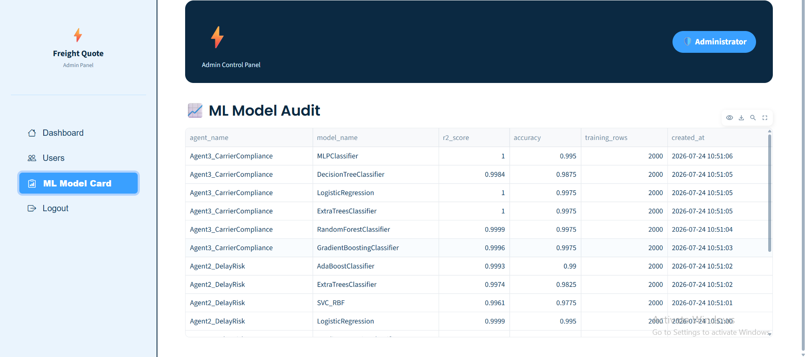
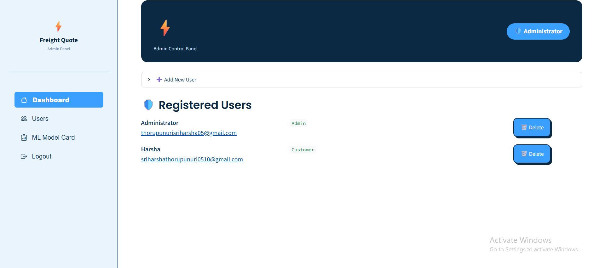
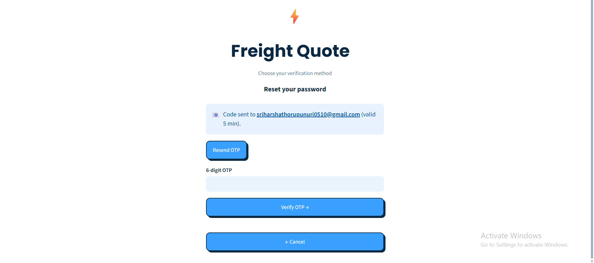
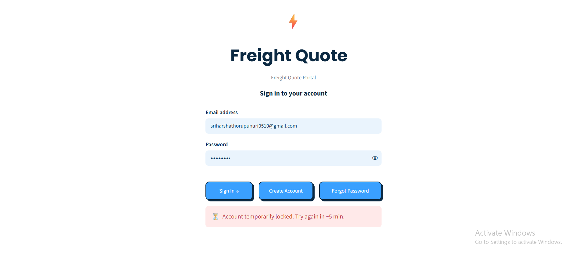
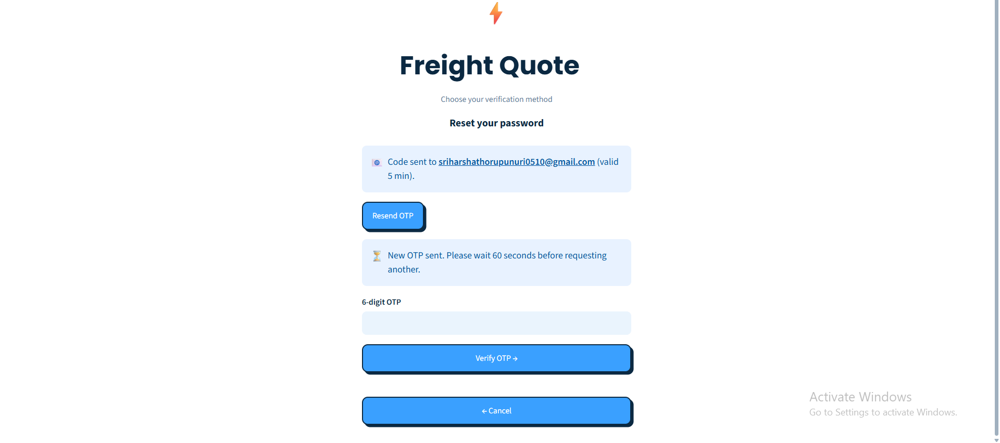

# FreightQuote AI — Milestone 2
## Full-Stack AI/ML Integration & Advanced Security Engine

## What Milestone 2 Adds on Top of Milestone 1
Milestone 1 delivered the standalone authentication module — Login, Signup, Forgot Password
(security question), and JWT session handling. Milestone 2 unifies that security gateway
with the full multi-agent ML core and an LLM Copilot, and adds three hardening layers:

- **Progressive account lockout** — 5 consecutive failed logins escalate from a 5-minute
  lock, to a 15-minute lock, to a permanent lock that only an Admin can clear.
- **Gmail OTP recovery with resend cooldown** — a proper OTP-based Forgot Password route
  alongside the existing security-question route, with an escalating resend cooldown
  (60s → 3min → 5min → 1hr) to prevent abuse.
- **Dynamic password strength checker** — live feedback (Weak / Average / Good) during
  registration and password reset, blocking anything under 5 characters.
- **Three autonomous ML agents**, each trained on 2 real Kaggle datasets and comparing
  7 algorithms (5+ required) before a champion model is selected and logged.
- **An LLM Copilot** (Qwen2.5-3B-Instruct, 4-bit quantized) that synthesizes all three
  agents' outputs into executive recommendations and structured JSON audit actions.
- **A fully functional Admin Dashboard** — Add User, Delete User, Unlock Account, and an
  ML Model Card tab showing every agent's champion metrics.

## Features Implemented
- **Phase 1 — Security Gateway:** Login, Registration, Forgot Password (Security Question
  + Gmail OTP) gate every other tab. Hashed credentials, progressive lockout state, and
  OTP cooldown state all live in SQLite.
- **Phase 2 — Domain Intelligence:** Agent 1 (Dynamic Pricing), Agent 2 (Route Delay
  Classifier), Agent 3 (Carrier Compliance Sentinel) — each with its own interactive tab,
  live charts, and confidence intervals.
- **Phase 3 — Generative Advisory:** The LLM Copilot answers free-form questions, runs a
  3-agent "debate" view, and produces a structured JSON audit action combining all three
  agents' numeric outputs.
- **Phase 4 — System Administration:** Admin-only dashboard with GPU health, user
  lifecycle controls (add/delete/unlock), and an ML Model Card comparing every trained
  algorithm's R²/ROC-AUC.

## System Architecture — 4 Phases
| Phase | Module / Component | Responsibility |
|---|---|---|
| Phase 1: Security Gateway | `auth.py` | Enforces Login, Registration, Forgot Password (Security Question + Gmail OTP) before unlocking the UI. Stores hashed credentials and lockout state in SQLite (`users` table). |
| Phase 2: Domain Intelligence | `agent2_freight.py`, `agent3_freight.py`, Agent 1 tab in `app.py` | Once authenticated, unlocks Agent 1 (Pricing), Agent 2 (Route Delay), Agent 3 (Carrier Compliance) tabs. |
| Phase 3: Generative Advisory | `llm_engine_freight.py` | Synthesizes the 3 agents' numeric outputs into executive shipping strategies and structured JSON audit actions via Qwen2.5-3B-Instruct (4-bit). |
| Phase 4: System Administration | `admin_dash.py` | Add/Delete/Unlock user controls and ML Model Card, restricted to `role = 'Admin'`. |

## Indian Port Coverage
| Port | Region | Primary Cargo |
|---|---|---|
| Mumbai (JNPT) | West Coast | Containerized cargo / Electronics |
| Mundra | Gujarat | Bulk / General cargo |
| Chennai | East Coast (Bay of Bengal) | Automobiles / Pharmaceuticals |
| Cochin | Kerala (Arabian Sea) | Spices / Chemicals |

## Technologies Used
| Technology | Purpose |
|---|---|
| Python | Core application and ML logic |
| Streamlit | Interactive web application UI |
| SQLite | Users, quotes, shipments, carriers, ML metrics, chat history |
| PyJWT | Secure session token issuance and verification |
| bcrypt | Password and security-answer hashing |
| scikit-learn | 7-algorithm comparison per ML agent |
| joblib | Champion model persistence |
| Transformers + bitsandbytes | Qwen2.5-3B-Instruct 4-bit inference (LLM Copilot) |
| Plotly | Interactive charts (radar, bar, gauge, pie) |
| Gmail SMTP | OTP delivery for password recovery |
| Kaggle API / kagglehub | Real logistics datasets for agent training |
| ngrok | Public HTTPS URL for the Colab-hosted app |
| Google Colab (T4 GPU) | Development and execution environment |

## 3. Colab Runtime, GPU & Secrets Setup

### 3.1 Switch the Runtime to GPU
1. **Runtime → Change runtime type → T4 GPU → Save**
2. Run `!nvidia-smi` as the first cell to confirm the GPU is attached.
3. The model loads with `load_in_4bit=True` (bitsandbytes) to keep VRAM usage low.

### 3.2 Create a Kaggle API Token (recommended, optional)
1. Log in at kaggle.com → profile picture → **Settings → API → Create New Token**
2. This downloads `kaggle.json` containing a username and key.
3. Add both as Colab Secrets (below). The notebook works without this — it falls back
   to synthetic data.

### 3.3 Store All Secrets in Colab Secrets
Click the 🔑 key icon in the left sidebar, add each secret below, and toggle **notebook access ON** for each.

| Secret Name | How to Get It | Used For |
|---|---|---|
| `JWT_SECRET_KEY` | Any long random string you make up | Signs & verifies login session tokens |
| `ADMIN_EMAIL_ID` | Any email you choose (defaults to `infosys@ai`) | Bootstraps the admin account |
| `ADMIN_PASSWORD` | Any password meeting the strength rule | Bootstraps the admin account |
| `NGROK_AUTHTOKEN` | ngrok.com → dashboard → copy Authtoken | Public HTTPS URL for the app |
| `HF_TOKEN` | HuggingFace → Settings → Access Tokens | Authenticates Qwen2.5-3B (4-bit) inference |
| `EMAIL_ID` | Your Gmail address | Sender address for real OTP emails (optional — console fallback works without it) |
| `EMAIL_PASSWORD` | Gmail → 2-Step Verification → App Passwords | Authenticates Gmail SMTP for OTP emails |
| `KAGGLE_USERNAME` / `KAGGLE_KEY` | From `kaggle.json` (Section 3.2) | Optional — trains on real Kaggle data |

## How to Run the Project
1. Open `FreightQuote_AI_Milestone2.ipynb` in Google Colab.
2. Set the runtime to T4 GPU (Section 3.1) and confirm with `!nvidia-smi`.
3. Add all secrets listed above under Colab Secrets.
4. Run every cell top to bottom, in order.
5. Open the printed ngrok URL.
6. Log in with `ADMIN_EMAIL_ID` / `ADMIN_PASSWORD`, then test: Home KPIs, AI Copilot,
   ML Pricing Calculator, and Admin Panel → ML Model Card tab.

## Progressive Account Lockout
| Failed Attempts | Action | Message |
|---|---|---|
| 3rd consecutive | Lock for 5 minutes | ⏳ Account temporarily locked for 5 minutes due to 3 failed attempts. |
| 4th consecutive | Lock for 15 minutes | ⏳ Account temporarily locked for 15 minutes due to 4 failed attempts. |
| 5th consecutive | Permanent lock | ❌ Account permanently locked due to 5 failed attempts. Only the System Administrator can unlock this account via the Admin Dashboard. |

## OTP Resend Cooldown
| Resend Attempt | Cooldown | Notification |
|---|---|---|
| 1st resend | 60 seconds | ⏳ Please wait 60 seconds before requesting another OTP. |
| 2nd resend | 3 minutes | ⏳ Please wait 3 minutes before requesting another OTP. |
| 3rd resend | 5 minutes | ⏳ Please wait 5 minutes before requesting another OTP. |
| 4th+ resend | 1 hour | ⚠️ Too many OTP requests. Please wait 1 hour before trying again. |

## Password Strength Policy
| Length | Badge | Behavior |
|---|---|---|
| < 5 characters | 🔴 Weak | Blocked — cannot register or reset. |
| 5–9 characters | 🟡 Average | Allowed, with a recommendation to lengthen it. |
| 10+ characters | 🟢 Good | Allowed — proceeds with bcrypt hashing. |

## ML Agents — 7 Algorithms Compared per Agent (5+ required)
| Agent | Metric | Algorithms |
|---|---|---|
| Agent 1: Dynamic Pricing (Regression) | R² ≥ 0.90 | RandomForestRegressor, GradientBoostingRegressor, ExtraTreesRegressor, Ridge, DecisionTreeRegressor, AdaBoostRegressor, KNeighborsRegressor |
| Agent 2: Route Delay (Classification) | ROC-AUC | RandomForestClassifier, GradientBoostingClassifier, LogisticRegression, SVC (RBF), ExtraTreesClassifier, AdaBoostClassifier, KNeighborsClassifier |
| Agent 3: Carrier Audit (Classification) | ROC-AUC | GradientBoostingClassifier, RandomForestClassifier, ExtraTreesClassifier, LogisticRegression, DecisionTreeClassifier, AdaBoostClassifier, MLPClassifier |

## Kaggle Datasets per Agent
| Agent | Dataset | Kaggle Slug |
|---|---|---|
| Agent 1 | SCMS Delivery Pricing Data | `apoorvwatsky/supply-chain-shipment-pricing-data` |
| Agent 1 | DataCo Smart Supply Chain | `shashwatwork/dataco-smart-supply-chain-for-big-data-analysis` |
| Agent 2 | Supply Chain Analysis Data | `harshsingh2209/supply-chain-analysis` |
| Agent 2 | International Trade Logistics | `victorchen/international-trade-logistics-dataset` |
| Agent 3 | Freight Carrier Performance | `davidcariboo/freight-carrier-performance` |
| Agent 3 | Logistics Shipment Audit Data | `suraj520/logistics-shipment-audit-data` |

## Admin Dashboard — User Lifecycle Management
| Feature | Implementation |
|---|---|
| Add User | Admin creation form (username, email, initial password, role) |
| Delete User | 🗑️ button per row — removes the account after confirmation |
| Unlock Account | 🔓 button for any locked/failed-out account — resets attempts and status to active |
| ML Model Card | Shows every agent's saved metrics (R²/RMSE or ROC-AUC) from the `ml_models` table |

## Screenshots

### 1. Home Page

KPI overview after login — active shipments, quotes today, on-time rate, and account status.

### 2. AI Copilot

A live prompt and response from the Qwen2.5-3B Copilot, synthesizing route, pricing, and carrier data.

### 3. ML Pricing Calculator

Agent 1 generating a freight cost estimate with a 95% confidence interval from the input parameters.

### 4. Admin Panel — ML Model Card

Champion model metrics (R²/ROC-AUC) logged for every algorithm trained across all three agents.

### 5. Admin Panel — Add / Delete / Unlock User Actions

The Admin Dashboard's user management panel, showing account creation and deletion controls.

### 6. OTP Verification Screen

The Forgot Password → Email OTP flow, showing a sent code awaiting verification.

### 7. Triggered Lockout Message

The progressive lockout warning shown after 3 consecutive failed login attempts.

### 8. OTP Cooldown Message

The resend rate-limit warning shown when requesting another OTP too soon.
