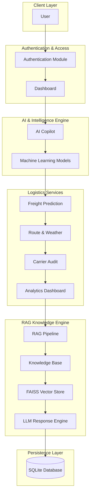

# 🚢 FreightQuote AI – Enterprise AI-Powered Maritime Brokerage Platform

> **Infosys Springboard Internship Project – Milestone 3**

---

## 🏷️ Badges


---

## 📖 Project Overview

FreightQuote AI is an AI-powered enterprise maritime brokerage platform developed as part of the Infosys Springboard Internship Program. The platform is designed to simplify and automate freight quotation generation, shipment analysis, carrier evaluation, and logistics decision-making using Artificial Intelligence, Machine Learning, and Retrieval-Augmented Generation (RAG).

The project integrates secure authentication, intelligent freight pricing, route and weather analysis, carrier auditing, analytics, and an AI Copilot into a single unified application.

Milestone 3 focuses on integrating the work completed in Milestone 1 and Milestone 2 while extending the application with a Retrieval-Augmented Generation (RAG) pipeline, document knowledge base, and collaborative project documentation.

---

## 📑 Table of Contents

- [Project Banner](#-freightquote-ai--enterprise-ai-powered-maritime-brokerage-platform)
- [GitHub Badges](#%EF%B8%8F-badges)
- [Project Overview](#-project-overview)
- [Project Objectives](#-project-objectives)
- [Problem Statement](#-problem-statement)
- [Proposed Solution](#-proposed-solution)
- [Key Features](#-key-features)
- [Technology Stack](#-technology-stack)
- [System Architecture](#-system-architecture)
- [Project Workflow](#-project-workflow)
- [Repository Structure](#-repository-structure)
- [Milestone Overview](#-milestone-overview)
- [Milestone 1](#-milestone-1--secure-authentication-module)
- [Milestone 2](#-milestone-2--multi-agent-ai-platform)
- [Milestone 3](#-milestone-3--project-integration--rag-pipeline)
- [Artificial Intelligence](#-artificial-intelligence)
- [Machine Learning](#-machine-learning)
- [Retrieval-Augmented Generation (RAG)](#-retrieval-augmented-generation-rag)
- [Security Features](#-security-features)
- [Datasets Used](#-datasets-used)
- [Documentation Used](#-documentation-used)
- [Performance Metrics](#-performance-metrics)
- [Testing Strategy](#-testing-strategy)
- [Installation Guide](#-installation-guide)
- [Deployment](#-deployment)
- [User Guide](#-user-guide)
- [Application Screenshots](#-application-screenshots)
- [Future Enhancements](#-future-enhancements)
- [GitHub Collaboration Workflow](#-github-collaboration-workflow)
- [Repository Guidelines](#-repository-guidelines)
- [Project Highlights](#-project-highlights)
- [Contributors](#-contributors)
- [References](#-references)
- [Contact](#-contact)
- [Support](#-support)
- [License](#-license)

---

## 🎯 Project Objectives

The primary objectives of FreightQuote AI are:

- Develop an enterprise-grade AI-powered freight quotation system.
- Automate freight pricing using Machine Learning algorithms.
- Assist logistics managers through an intelligent AI-powered Copilot.
- Analyze shipping routes and dynamic weather conditions.
- Evaluate carrier performance, reliability, and compliance.
- Build a Retrieval-Augmented Generation (RAG) pipeline for document-based question answering.
- Integrate all project milestones into a single modular application.
- Maintain collaborative software development practices using GitHub.

---

## 🌍 Problem Statement

The maritime logistics industry faces several challenges in generating freight quotations due to dynamic pricing, varying carrier performance, changing weather conditions, and the large volume of unstructured logistics documents. Manual quotation generation is time-consuming, error-prone, and inefficient.

FreightQuote AI addresses these challenges by leveraging Artificial Intelligence, Machine Learning, and Retrieval-Augmented Generation (RAG) to automate freight quotation generation, provide intelligent logistics recommendations, and retrieve relevant information from logistics documents accurately.

---

## 💡 Proposed Solution

FreightQuote AI provides an enterprise-level solution that combines secure authentication, AI-powered freight prediction, carrier evaluation, weather analysis, intelligent document retrieval, and an AI Copilot into a single unified platform.

The platform enables logistics managers to make data-driven decisions by utilizing trained machine learning models for pricing predictions and a RAG-powered document retrieval engine for context-aware, grounded responses.

---

## ⭐ Key Features

- **Secure User Authentication**: Complete access control with password hashing, email OTP verification, and JWT session tokens.
- **AI Copilot**: Logistics assistant powered by the Qwen 2.5 Large Language Model.
- **Freight Price Prediction**: Automated pricing engine using trained machine learning models.
- **Route & Weather Analysis**: Risk assessment and weather monitoring for shipping lanes.
- **Carrier Performance Audit**: Evaluation of carrier compliance, speed, and cost efficiency.
- **Analytics Dashboard**: Aggregated operational insights, KPIs, and performance charts.
- **Model Retraining Engine**: Capabilities to retrain predictive models on new logistics datasets.
- **Admin Dashboard**: Comprehensive user management, role assignments, and system auditing.
- **Retrieval-Augmented Generation (RAG)**: Document QA pipeline powered by FAISS and LangChain.
- **PDF Knowledge Base**: Centralized repository of maritime guidelines, policies, and manuals.
- **Semantic Search**: Fast vector similarity search over dense document embeddings.
- **Intelligent Question Answering**: Grounded responses combining LLMs and retrieved document context.

---

## 🛠 Technology Stack

| Layer | Technologies |
| :--- | :--- |
| **Frontend** | Streamlit |
| **Backend** | Python |
| **Database** | SQLite |
| **Machine Learning** | Scikit-learn, Pandas, NumPy |
| **Artificial Intelligence** | Hugging Face Transformers, Qwen 2.5 LLM |
| **Retrieval-Augmented Generation (RAG)** | LangChain, FAISS, Sentence Transformers |
| **Deployment** | Google Colab, Ngrok |
| **Version Control** | Git, GitHub |

---

## 🏗 System Architecture



---

## 🔄 Project Workflow

1. **User Authentication**: User logs into the platform via credential validation or email OTP verification.
2. **Access Control**: Authentication module validates credentials and issues a secure user session.
3. **Module Selection**: User navigates the unified dashboard to select specific operational AI tools.
4. **Freight Price Estimation**: Machine learning agents predict quotation prices based on cargo inputs.
5. **Route & Environmental Assessment**: Route and weather module evaluates shipping lane conditions.
6. **Carrier Auditing**: Carrier Audit agent evaluates performance, compliance score, and reliability.
7. **RAG Context Retrieval**: RAG pipeline searches the vector database for relevant logistics documentation chunks.
8. **AI Copilot Synthesis**: AI Copilot combines retrieved document context and ML predictions into grounded responses.
9. **Business Intelligence**: Analytics dashboard displays real-time metrics, quotation histories, and model performance.
10. **Administrative Controls**: Admin users manage system accounts, audit logs, and trigger model retraining.

---

## 📁 Repository Structure

```
Infosys_FreightQuote_AI/
│
├── README.md
├── screenshots/
│   ├── login.png
│   ├── register.png
│   ├── otp.png
│   ├── forgot_password.png
│   ├── user_dashboard.png
│   ├── ai_copilot.png
│   ├── freight_prediction.png
│   ├── route_weather.png
│   ├── carrier_audit.png
│   ├── analytics_dashboard.png
│   ├── admin_dashboard.png
│   ├── model_retraining.png
│   ├── rag_knowledge_base.png
│   ├── document_upload.png
│   ├── rag_query.png
│   ├── semantic_search.png
│   ├── model_comparison.png
│   ├── champion_model.png
│   ├── project_workflow.png
│   └── system_architecture.png
│
├── Milestone_1/
│   ├── Milestone1.ipynb
│   ├── README.md
│   ├── app.py
│   ├── db.py
│   ├── auth.py
│   ├── utils.py
│   ├── requirements.txt
│   └── users.db
│
├── Milestone_2/
│   ├── FreightQuote_AI_Milestone2.ipynb
│   ├── README.md
│   ├── auth.py
│   ├── db.py
│   ├── admin_dash.py
│   ├── ui_theme.py
│   ├── train_ml_freight.py
│   ├── llm_engine_freight.py
│   ├── requirements.txt
│   └── users.db
│
└── Milestone_3/
    ├── FreightQuote_AI_M1_M2_Combined.ipynb
    ├── RAG_Pipeline.ipynb
    ├── README.md
    └── evaluation_queries.md
```

---

## 📌 Milestone Overview

The FreightQuote AI platform was constructed over three distinct development milestones:

- **Milestone 1**: Built the enterprise security foundation, establishing database schemas, user registration, JWT authentication, password encryption, and multi-factor authentication.
- **Milestone 2**: Created the core AI and Machine Learning agent infrastructure, deploying predictive freight models, route/weather analytics, carrier evaluation tools, and administrative dashboards.
- **Milestone 3**: Consolidated Milestones 1 and 2 into an integrated platform while adding an end-to-end Retrieval-Augmented Generation (RAG) pipeline with FAISS vector search and Qwen 2.5 LLM grounding.

---

## ✅ Milestone 1 – Secure Authentication Module

Milestone 1 focused on engineering a robust, secure authentication system for the platform.

### Key Features Implemented

- **User Registration**: Form validation and account creation.
- **Secure Login**: Session-based and JWT token authentication.
- **Password Hashing**: Cryptographic password protection using SHA-256 / bcrypt.
- **Forgot Password**: Password reset workflow with security validation.
- **Security Questions**: Secondary authorization verification.
- **Email OTP Verification**: One-Time Password generation and expiration controls.
- **Role-Based Access Control (RBAC)**: Distinct permissions for Users and Administrators.
- **SQLite Database Integration**: Persistent relational storage for user credentials and logs.

---

## ✅ Milestone 2 – Multi-Agent AI Platform

Milestone 2 introduced the core AI-powered logistics agents and analytical modules.

### Core Modules

- **🤖 AI Copilot**: Conversational logistics assistant powered by the Qwen 2.5 Large Language Model.
- **🚢 Agent 1 – Freight Pricing**: Machine learning pricing agent estimating shipping costs dynamically.
- **🌦 Agent 2 – Route & Weather Analysis**: Intelligence module evaluating transit risks and maritime weather patterns.
- **📊 Agent 3 – Carrier Audit**: Evaluation framework auditing carrier reliability, compliance, and historic performance.
- **📈 Analytics Dashboard**: Visual dashboard tracking quotation volume, cost distribution, and agent accuracy.
- **🔄 Model Retraining**: Automated pipeline for updating machine learning models with newly acquired datasets.
- **👨‍💼 Admin Dashboard**: Central control hub for system configuration, user management, and activity monitoring.

---

## ✅ Milestone 3 – Project Integration & RAG Pipeline

Milestone 3 integrated all platform components into a unified solution enhanced by Retrieval-Augmented Generation.

### Major Activities

- Full integration of Milestone 1 authentication with Milestone 2 operational agents.
- Development of a dedicated Jupyter notebook (`RAG_Pipeline.ipynb`) for vector pipeline experiments.
- Curation and structured organization of maritime policy and logistics PDF documents.
- Text extraction, cleaning, and recursive chunking for knowledge base preparation.
- Embedding generation using Sentence Transformers and vector indexing via FAISS.
- Implementation of context-grounded prompt construction for LLM response generation.
- Automated evaluation suite setup with test queries (`evaluation_queries.md`).
- Structured GitHub collaboration utilizing feature branches and Pull Requests.

---

## 🤖 Artificial Intelligence

FreightQuote AI leverages modern natural language processing and generative AI architectures:

- **Qwen 2.5 Large Language Model**: Serves as the primary inference engine for natural language reasoning.
- **Hugging Face Transformers**: Open-source framework used for loading, quantizing, and running local model pipelines.
- **AI Copilot Interface**: Interactive conversational agent assisting users with complex logistics workflows.
- **Natural Language Processing (NLP)**: Automated intent extraction, prompt parsing, and domain-specific entity extraction.
- **Context Augmentation**: Dynamic injection of retrieved domain documents into LLM context windows.

---

## 📊 Machine Learning

The platform employs supervised machine learning models to predict freight quotation rates based on historical shipping data:

### Algorithms Evaluated

- **Random Forest Regressor**
- **Decision Tree Regressor**
- **Gradient Boosting Regressor**
- **Linear Regression**
- **Support Vector Regression (SVR)**

### Model Selection Workflow

Models undergo rigorous cross-validation. The highest-performing model according to accuracy metrics is selected and serialized as the **Champion Model** for real-time inference in production.

---

## 📂 Retrieval-Augmented Generation (RAG)

The RAG architecture enables FreightQuote AI to answer questions using authoritative, private logistics documentation without requiring model fine-tuning.

```
Logistics PDFs ➔ Text Extraction ➔ Chunking ➔ Embeddings (Sentence Transformers) ➔ FAISS Vector Store ➔ Context Retrieval ➔ Qwen 2.5 LLM ➔ Grounded Answer
```

### RAG Pipeline Components

1. **Document Ingestion**: Loading PDF files containing shipping rules, port operations, and compliance policies.
2. **Text Preprocessing & Chunking**: Splitting documents into overlapping text chunks to preserve semantic context.
3. **Embedding Generation**: Converting text chunks into high-dimensional dense vector representations.
4. **Vector Storage**: Indexing vectors inside a high-performance **FAISS** index for similarity search.
5. **Context Retrieval**: Performing k-Nearest Neighbors (k-NN) search to retrieve the most relevant text chunks for a query.
6. **Augmented Generation**: Formatting retrieved chunks into an explicit context prompt for the Qwen 2.5 model.

---

## 🔐 Security Features

- **JWT Authentication**: Secure, stateless JSON Web Tokens for API session management.
- **Cryptographic Hashing**: Secure storage of user credentials using industry-standard hashing.
- **Email OTP Verification**: Two-factor authentication via timed One-Time Passwords.
- **Security Challenge Questions**: Alternate account recovery verification layer.
- **Role-Based Access Control (RBAC)**: Fine-grained access privileges separating general users from administrators.
- **Admin Control Panel**: Real-time auditing of user sign-ins, privilege updates, and account status.
- **Secure Session Management**: Automatic session expiration and lockout protections after repeated failed attempts.

---

## 📊 Datasets Used

The platform is trained and validated on comprehensive logistics data sources:

- **Freight Pricing Dataset**: Historical shipment rates, container dimensions, origin/destination ports, and seasonal charges.
- **Carrier Performance Dataset**: Historical delivery timeliness, damage incident rates, and compliance records.
- **Port Information Dataset**: Geographical coordinates, handling capabilities, and port congestion metrics.
- **Weather Dataset**: Maritime weather observations, wave heights, wind speeds, and storm warning logs.
- **Shipment Dataset**: Active shipment status records and cargo category classifications.
- **Logistics PDF Collection**: Maritime policy documents, international trade guidelines, and port manuals.

---

## 📚 Documentation Used

The RAG knowledge base indexes standard industry documentation:

- International Maritime Freight Policies
- Port Operations & Handling Manuals
- Maritime Customs & Regulatory Compliance Guidelines
- Carrier Service Level Agreements (SLAs)
- Logistics Risk & Liability Documents
- Global Shipping Route Standards

---

## 📈 Performance Metrics

Machine learning models and regression pipelines are benchmarked against standard quantitative metrics:

- **Accuracy / R² Score (Coefficient of Determination)**: Evaluates total variance explained by the pricing model.
- **Root Mean Squared Error (RMSE)**: Quantifies prediction magnitude error in currency units.
- **Precision, Recall, & F1-Score**: Evaluates carrier compliance classification models.

The model demonstrating the optimal balance of lowest RMSE and highest R² score is automatically designated as the **Champion Model**.

---

## 🧪 Testing Strategy

The project employs a multi-tiered software testing methodology:

- **Unit Testing**: Isolated verification of data preprocessing scripts, utility functions, and database handlers.
- **Integration Testing**: Verification of seamless data flow between Streamlit UI, SQLite database, and ML endpoints.
- **Functional Testing**: End-to-end testing of user registration, OTP generation, and password resets.
- **User Acceptance Testing (UAT)**: Scenario testing designed around logistics manager workflows.
- **AI Response Validation**: Verification of LLM outputs to guard against hallucination and verify context grounding.
- **ML Model Evaluation**: Automated benchmarking of regressor models on held-out test datasets.

---

## 📥 Installation Guide

Follow these steps to set up and run FreightQuote AI on your local environment:

### Prerequisites

- **Python**: Version 3.10 or higher
- **Git**: Installed on your local machine

### 1. Clone the Repository

```bash
git clone https://github.com/your-username/Infosys_FreightQuote_AI.git
cd Infosys_FreightQuote_AI
```

### 2. Create and Activate Virtual Environment

```bash
# Windows
python -m venv venv
venv\Scripts\activate

# Linux / macOS
python3 -m venv venv
source venv/bin/activate
```

### 3. Install Dependencies

```bash
pip install --upgrade pip
pip install -r Milestone_3/requirements.txt
```

### 4. Initialize Database & Models (Optional)

```bash
python Milestone_2/train_ml_freight.py
```

### 5. Launch the Streamlit Application

```bash
streamlit run Milestone_1/app.py
```

Access the application in your web browser at `http://localhost:8501`.

---

## 🚀 Deployment

### Current Environment

- **Google Colab**: Used for GPU-accelerated LLM inference and heavy model training.
- **Ngrok**: Provides secure HTTPS tunneling to expose the local Streamlit server publicly during demonstrations.
- **Streamlit**: Serves as the web application container.

### Enterprise Target Environments

- **Docker**: Containerization for reproducible microservice deployment.
- **Streamlit Cloud**: Hosting platform for lightweight app previews.
- **Microsoft Azure / AWS**: Enterprise cloud hosting utilizing managed database and GPU compute instances.

---

## 📖 User Guide

1. **Account Registration**: Navigate to the registration page, enter your user details, and set up security questions.
2. **OTP Verification**: Enter the One-Time Password sent to your registered email address to activate your account.
3. **Secure Login**: Sign in with your credentials to generate a secure session token.
4. **Dashboard Access**: Select your operational goal from the main navigation panel.
5. **Generate Freight Quotations**: Input shipment origin, destination, container type, and weight into the Freight Pricing module to get instant ML cost estimates.
6. **Analyze Route & Weather**: Run route simulations to check transit risks and current ocean weather alerts.
7. **Audit Carrier Reliability**: Query the Carrier Audit database to compare carrier scores and compliance records.
8. **Query RAG Knowledge Base**: Use the RAG interface to search logistics documentation and ask domain-specific questions to the AI Copilot.
9. **Admin Administration**: Log in with administrator credentials to manage user access, review system audit logs, or trigger model retraining.

---

## 📸 Application Screenshots

## Login


---

## User Registration


---

## Email OTP Verification


---

## Forgot Password


---

## User Dashboard


---

## AI Copilot


---

## Freight Price Prediction


---

## Route & Weather Analysis


---

## Carrier Audit


---

## Admin Dashboard


---

## RAG Knowledge Base


---

## Semantic Search Results


---

## 🌟 Future Enhancements

- **Live Shipping APIs**: Direct integration with AIS vessel tracking and port authority APIs.
- **Real-Time Vessel Tracking**: Dynamic map views displaying vessel coordinates in transit.
- **Advanced Predictive Analytics**: Time-series forecasting for global freight rate trends.
- **Containerized Cloud Deployment**: Helm charts and Kubernetes manifests for enterprise cloud infrastructure.
- **Multi-Language AI Support**: Multilingual LLM capabilities for international logistics teams.
- **Mobile Application**: Native iOS/Android app for on-the-go freight monitoring.

---

## 🤝 GitHub Collaboration Workflow

The project was engineered collaboratively following standard open-source Git practices:

1. **Repository Cloning**: Each team member created a local clone of the shared central repository.
2. **Feature Branching**: Development was isolated on task-specific branches off `main` (`feature/auth`, `feature/rag-pipeline`).
3. **Commit Standards**: Modular commits accompanied by descriptive commit messages.
4. **Pull Requests (PRs)**: Work was submitted for integration via detailed GitHub Pull Requests.
5. **Peer Review**: Main maintainers reviewed code changes, verified tests, and managed branch merges.

---

## 📌 Repository Guidelines

- **Branch Hygiene**: Never push directly to the `main` branch; submit changes via Pull Requests.
- **Commit Messages**: Write clear, imperative commit messages summarizing changes.
- **Code Quality**: Follow PEP 8 guidelines for Python code style and readability.
- **Documentation**: Update markdown documentation whenever adding or altering features.
- **Modularity**: Maintain clean separation between UI components, database operations, and ML models.

---

## 📈 Project Highlights

- ✅ Enterprise AI-Powered Freight Management Platform
- ✅ Secure User Authentication (JWT, OTP, RBAC)
- ✅ Multi-Agent AI Architecture
- ✅ Machine Learning-Based Freight Price Prediction
- ✅ Route & Weather Condition Analysis
- ✅ Carrier Audit & Compliance Evaluation
- ✅ Interactive Analytics Dashboard
- ✅ AI Copilot Powered by Qwen 2.5 LLM
- ✅ Retrieval-Augmented Generation (RAG) Pipeline
- ✅ PDF Document Knowledge Base & FAISS Vector Store
- ✅ Semantic Search & Context-Grounded Q&A
- ✅ Model Retraining & Champion Model Selection
- ✅ Collaborative GitHub Development Workflow
- ✅ Enterprise Documentation Standards

---

## 👨‍💻 Contributors

| Name | Responsibility |
| :--- | :--- |
| **Smita Barada** | Developed the Retrieval-Augmented Generation (RAG) pipeline notebook, including knowledge base generation, retrieval, and semantic search workflow. |
| **Sriharsha Thorupunuri** | Prepared the complete project documentation, created and maintained the README, and managed the GitHub repository workflow. |
| **Syed Saleem Malik** | Designed and implemented the Streamlit frontend UI across the application's authentication, dashboard, and admin panels. |
| **Manuru Deepika** | Tested and verified the RAG pipeline, validated Hugging Face model integration, and configured ngrok deployment. |
| **Sravya Nanda** | Tested and validated the OTP verification flow and dashboard functionality across user and admin views. |

---

## 📚 References

- [Infosys Springboard Internship Guidelines](https://springboard.infosys.com)
- [Streamlit Official Documentation](https://docs.streamlit.io)
- [Scikit-Learn User Guide](https://scikit-learn.org/stable/user_guide.html)
- [Hugging Face Transformers Documentation](https://huggingface.co/docs/transformers)
- [LangChain Documentation](https://python.langchain.com/docs/)
- [FAISS Vector Database Documentation](https://faiss.ai/)
- [Python Official Documentation](https://docs.python.org/3/)
- [GitHub Documentation](https://docs.github.com)

---

## 📬 Contact

For project inquiries, support, or collaboration details, please reach out to the project team through the official repository issues page or via the Infosys Springboard platform portal.

---

## ⭐ Support

If you find this project valuable or useful for your enterprise logistics AI research, please consider giving the repository a ⭐ on GitHub!

---

## 📄 License

This project was developed for educational and research purposes as part of the **Infosys Springboard Internship Program**.

All rights belong to the respective project team members and Infosys Springboard.
