# Agentic AI for Maritime Freight Pricing and Route Optimization

### Codename: **FreightQuote AI**

> An agentic decision-support copilot for an ocean-freight brokerage — grounded routing, pricing, weather, and compliance answers.

<p align="center">


</p>

**Infosys Springboard Internship — Batch 1**

---

## 📑 Table of Contents

1. [Overall Project Explanation](#-overall-project-explanation)
2. [Architecture Diagram](#-architecture-diagram)
3. [The 9 Specialised Agents](#-the-9-specialised-agents)
4. [Authentication, OTP & Security](#-authentication-otp--security)
5. [Admin Dashboard](#-admin-dashboard)
6. [Screenshots](#-screenshots)
7. [requirements.txt](#-requirementstxt)
8. [Environment Variables & Security](#-environment-variables--security)
9. [Known Limitations & Future Scope](#-known-limitations--future-scope)
10. [Program & Team Context](#-program--team-context)
11. [Acknowledgements](#-acknowledgements)

---

## 📖 Overall Project Explanation

### Problem Statement

Ocean-freight brokers and logistics coordinators currently rely on manual spreadsheets, scattered SOP documents, and fragmented tools to price shipments, assess routing risk, vet carriers, and stay compliant with customs regulations. This slows down quoting, increases the risk of costly errors, and makes it hard for non-experts to get a fast, trustworthy answer to an operational question.

### Solution Summary

**FreightQuote AI** is an agentic decision-support platform that brings pricing, routing, carrier auditing, weather-risk monitoring, margin analysis, customs compliance, and document handling into a single Streamlit application. A grounded AI Copilot sits on top, answering natural-language questions using real data pulled from the platform's own database and machine-learning agents — not free-form generation. The system explicitly refuses to answer when it lacks sufficient evidence, favoring "I don't have enough information" over a fabricated number.

### Architecture Overview

FreightQuote AI follows a 4-layer pattern:

1. **Data Layer** — SQLite database seeded with ports, shipments, carriers, routes, freight quotes, customs data, and weather-risk snapshots.
2. **Reasoning Tools Layer** — 9 specialised agent modules, each covering one operational domain.
3. **Orchestration Layer** — an intent router that classifies each query and dispatches it to the right tool/solver.
4. **Generation Layer** — an LLM (Qwen2.5-3B-Instruct, with a 1.5B fallback) that turns retrieved facts into a final grounded answer.

See the full diagram in [Architecture Diagram](#-architecture-diagram).

### Full Technology Stack

| Layer | Technology | Purpose |
|---|---|---|
| Frontend / UI | Streamlit, streamlit-option-menu | Web application shell and sidebar navigation |
| Mapping | Folium, streamlit-folium | Live interactive port congestion & storm-severity maps |
| Machine Learning | scikit-learn (RandomForest, GradientBoosting, DecisionTree, LogisticRegression, SVC, LinearRegression) | Per-agent regression/classification benchmarking |
| Generative AI | Qwen2.5-3B-Instruct (fallback Qwen2.5-1.5B), Transformers, Accelerate | Grounded natural-language answer generation |
| Translation | NLLB-200 (distilled-600M) / deep-translator | Multilingual copilot & offline document translation |
| Retrieval / RAG | FAISS, sentence-transformers, custom chunking | Vector search over uploaded PDFs (Agent 9) |
| Document Processing | pdfplumber, ReportLab, FPDF | OCR-style extraction, PDF quote & Bill of Lading generation |
| Database | SQLite | Ports, shipments, carriers, quotes, users, alerts, chat history |
| Authentication | bcrypt, PyJWT | Password hashing, JWT session tokens |
| Data Feed / External API | Requests (Open-Meteo) | Live marine weather data |
| Visualization | Plotly | Bar, scatter, waterfall, heatmap, treemap, sunburst, box plot, histogram, pie charts |
| Backend Services | FastAPI, Uvicorn, Pydantic | Internal model-serving endpoint |
| Deployment / Tunneling | Ngrok / Cloudflare Tunnel | Public URL access from Google Colab |
| Data Handling | Pandas, NumPy | Data wrangling across all agents |

### Key Differentiators

- **Grounded generation** — the AI Copilot is instructed never to invent facts, metrics, or sources; when evidence is unavailable, it says so explicitly.
- **Transparent ML** — every predictive agent benchmarks multiple models side-by-side and shows which one was selected as "best" and on what metric.
- **RBAC role-awareness** — the UI itself adapts per role; a Customer never sees the Admin Dashboard menu item, and `render_admin_dashboard()` enforces the same check server-side as a second layer of defense.
- **Fail-soft LLM degrade path** — if there isn't enough GPU VRAM for the 3B model, the platform automatically falls back to the 1.5B model rather than crashing.

---

## 🏗️ Architecture Diagram


```
                    1. DATA LAYER
   seed_data.py populates SQLite with ports, shipments,
   carriers, routes, freight quotes, customs data,
   and weather-risk snapshots.
                         │
                         ▼
              2. REASONING TOOLS LAYER
   9 agent modules covering routes, pricing, carriers,
   weather, margin, customs, documents, translation,
   and PDF RAG.
                         │
                         ▼
               3. ORCHESTRATION LAYER
   intent_router.py classifies queries into shipment /
   pricing / weather / customs, with a Haversine route
   solver and a from-scratch freight-quote calculator.
                         │
                         ▼
                4. GENERATION LAYER
   llm_engine.py runs Qwen2.5-3B-Instruct (fallback 1.5B)
   to generate the final grounded answer from retrieved facts.
```

---

## 🤖 The 9 Specialised Agents

```
              AI COPILOT / ORCHESTRATION LAYER
                    (intent_router.py)
        ▼ routes each query to the right agent ▼

 1. Port & Route Intel   2. Freight Pricing   3. Carrier Performance
 4. Weather & Harbor Risk 5. Margin Optimizer  6. Customs & Compliance
 7. Quote & BoL Docs      8. Document Translation  9. Document RAG Engine
```

### Agent 1 — Global Ocean Port & Route Intelligence
Telemetry and routing across monitored global and Indian ports with a live congestion map.
- **ML models benchmarked:** RandomForest, GradientBoosting, DecisionTree, LogisticRegression, SVC
- **Reads from:** `ports`, `shipments` tables
- **Outputs:** Folium congestion map, route delay-risk classification, bar/scatter charts, AI Route Advisor

### Agent 2 — Dynamic Freight Pricing & Rate Calculator
Calculates and benchmarks ocean freight quotes (base rate + fuel surcharge + customs/terminal fees).
- **ML models benchmarked:** RandomForestRegressor, GradientBoostingRegressor, DecisionTreeRegressor, LinearRegression
- **Reads from:** `freight_quotes`, `ports` tables
- **Outputs:** Instant spot quote, waterfall cost build-up, correlation heatmap, quote-value funnel, AI Pricing Advisor

### Agent 3 — Carrier Performance & Safety Audit
Benchmarks shipping carriers on safety, reliability, and fleet capacity.
- **ML models benchmarked:** RandomForestClassifier, GradientBoostingClassifier, DecisionTreeClassifier, LogisticRegression, SVC
- **Reads from:** `carriers` table
- **Outputs:** Risk treemap, rating-vs-OTD scatter, correlation heatmap, 8-parameter capacity simulator, AI Carrier Advisor

### Agent 4 — Global Weather Risk & Harbor Safety Intelligence
Monitors severe-weather risk at monitored ports using **live Open-Meteo data**.
- **ML models benchmarked:** RandomForest, GradientBoosting, DecisionTree, LogisticRegression, SVC, LinearRegression
- **Reads from:** live Open-Meteo API + `ports` table
- **Outputs:** Storm-severity Folium map, wind-vs-wave safety-threshold scatter, AI Weather Advisor

### Agent 5 — Freight Margin Optimizer & Profitability Intelligence
Analyses where margin is earned or lost across quotes, with a carrier yield matrix.
- **ML models benchmarked:** RandomForestRegressor, GradientBoostingRegressor, DecisionTreeRegressor, LinearRegression
- **Reads from:** `freight_quotes`, `carriers` tables
- **Outputs:** Margin % box plot by carrier, cost-component heatmap, margin distribution histogram, AI Margin Advisor

### Agent 6 — Customs Intelligence & HS Code Compliance
Assesses regulatory clearance risk by country and cargo type with an 8-parameter duty simulator.
- **ML models benchmarked:** RandomForestClassifier, GradientBoostingClassifier, DecisionTreeClassifier, LogisticRegression, SVC
- **Reads from:** customs/regulatory reference tables
- **Outputs:** Duty-exposure sunburst, duty-vs-risk scatter, AI Customs Advisor

### Agent 7 — Quote Document & Bill of Lading Generator (OCR)
Produces shipping paperwork — auto-generated freight quote PDF and Bill of Lading — from live quote data.
- **ML models benchmarked:** none (document generation via ReportLab/FPDF, plus text extraction via pdfplumber)
- **Reads from:** `freight_quotes` table
- **Outputs:** Downloadable PDF quote and Bill of Lading

### Agent 8 — Freight Document & Policy Translation Engine
Offline translation of freight documents and policies, plus a maritime trade glossary (BAF, TEU, HS Code, dwell time).
- **ML models benchmarked:** NLLB-200 (distilled-600M) — translation, not a classical ML benchmark
- **Reads from:** user-provided text/document input
- **Outputs:** Translated text/document, batch translation, glossary reference

### Agent 9 — Custom PDF Knowledge Base & Vector RAG Engine
Upload-your-own-document workbench for customs manuals and carrier contracts, chunked and indexed for grounded Q&A.
- **ML models benchmarked:** none — FAISS + sentence-transformers retrieval
- **Reads from:** user-uploaded PDFs (chunked and embedded on upload)
- **Outputs:** Grounded, source-cited natural-language answers


### 📚 Maritime Glossary

| Term | Meaning |
|---|---|
| **BAF** | Bunker Adjustment Factor — a fuel-price surcharge added to the base ocean freight rate |
| **TEU** | Twenty-foot Equivalent Unit — the standard unit for measuring container capacity |
| **HS Code** | Harmonized System Code — the international classification code used for customs duties |
| **Dwell Time** | The amount of time cargo/containers spend sitting at a port before departure |
| **Bill of Lading** | A legal document issued by a carrier to a shipper, detailing the type, quantity, and destination of the goods being carried |
| **OTD** | On-Time Delivery — percentage of shipments delivered within the promised window |

---

## 🔐 Authentication, OTP & Security

### Auth Flow

```
Signup → Login → JWT Session → Forgot Password → OTP or Security Question → Reset
```

- **Signup:** username, email, password (strength-checked), and a security question/answer are captured and stored (password and security answer are hashed with bcrypt — never stored in plaintext).
- **Login:** on success, a JWT session token is issued and stored in `st.session_state`; repeated failed attempts trigger a temporary account lockout.
- **Forgot Password:** two independent recovery routes are supported —
  - **Security Question route** — answer the previously-set question to reset directly.
  - **OTP route** — a 6-digit, time-limited OTP is emailed to the registered address; verifying it unlocks a password-reset form.
- **Logout:** clears the JWT and all session state.

> OTP delivery credentials and all other sensitive configuration are supplied via environment variables / Colab Secrets and are **never committed to the repository**. See [Environment Variables & Security](#-environment-variables--security).

### RBAC Roles

| Role | Typical Access |
|---|---|
| **Admin** | All tabs, including the Admin Dashboard and full agent suite |
| **Freight Broker / Regional Ops Manager** | All agents and the AI Copilot, excluding the Admin Dashboard |
| **Dispatcher** | AI Copilot + a subset of operational agents |
| **Customer / Client** | AI Copilot plus quote-related agents only |

---

## 🛡️ Admin Dashboard


**Admin-only capabilities:**
- User management & role assignment (add, delete, promote, demote, unlock accounts)
- System health monitoring (database status, LLM/GPU status, translation engine status)
- ML model performance ledger (accuracy / F1 / R² per agent)
- Chat history & audit trail across all users

---

## 📸 Screenshots

| Login | Forgot Password | OTP Verification |
|---|---|---|
| 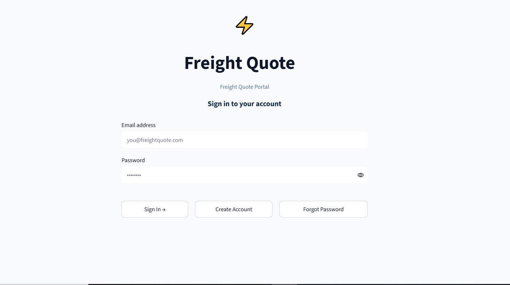 | 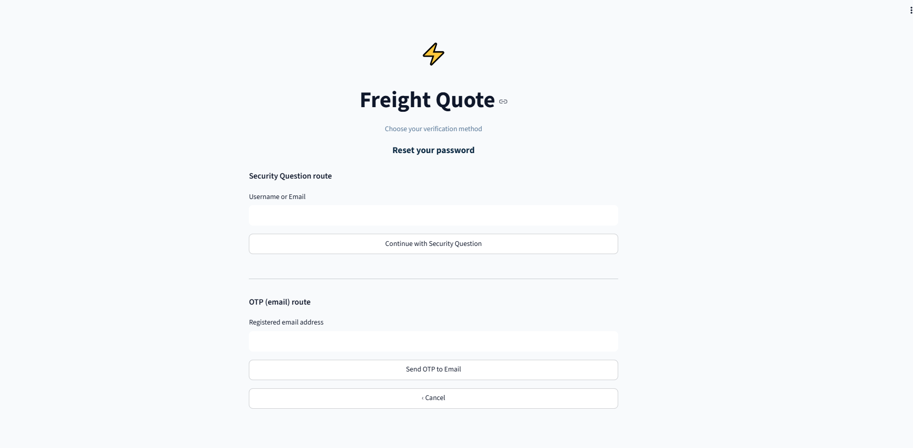 | 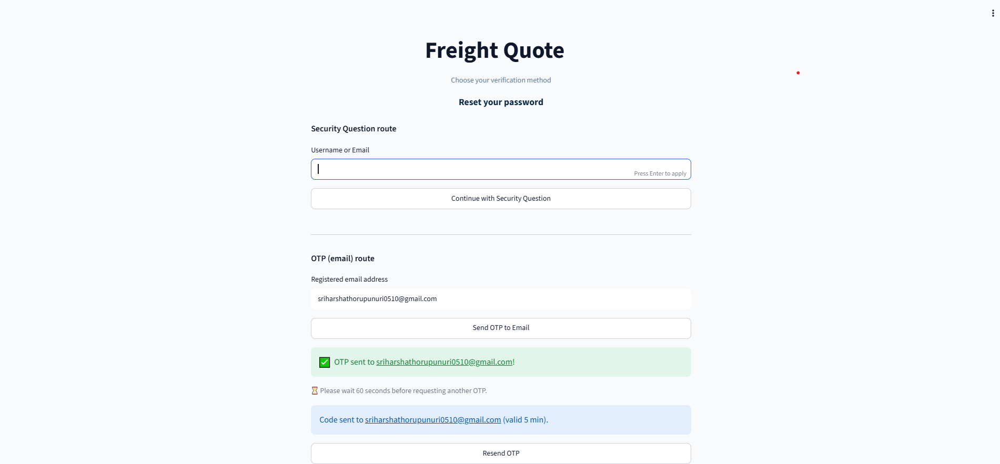 |

| Customer Dashboard | AI Copilot (Grounded Answer) | Admin Dashboard |
|---|---|---|
| 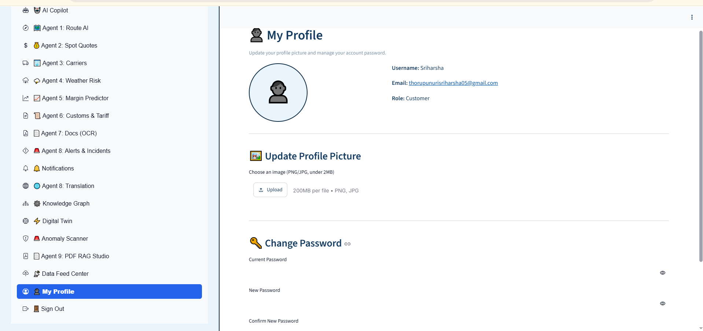 | 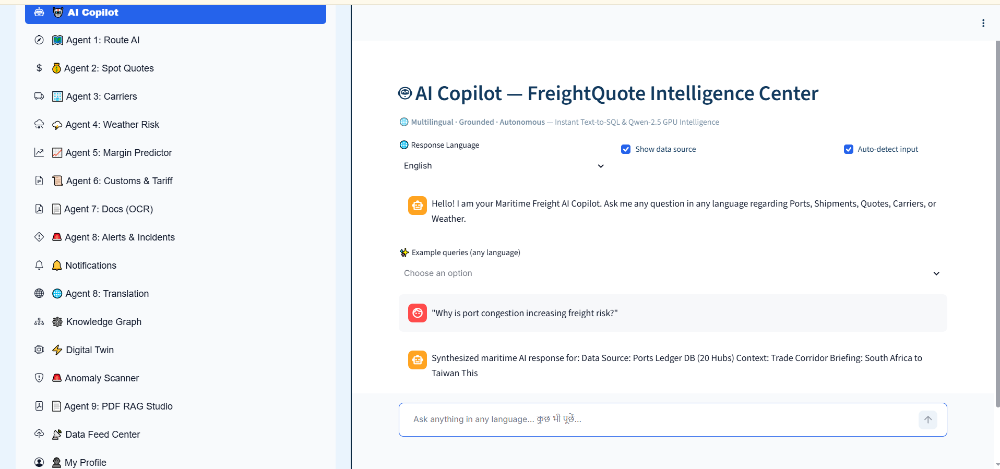 |  |

### 🤖 All 9 Agents

| Agent 1: Route & Port Intelligence | Agent 2: Freight Pricing | Agent 3: Carrier Performance |
|---|---|---|
| 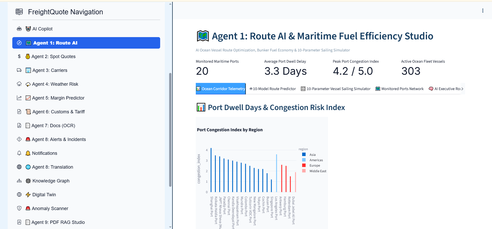 | 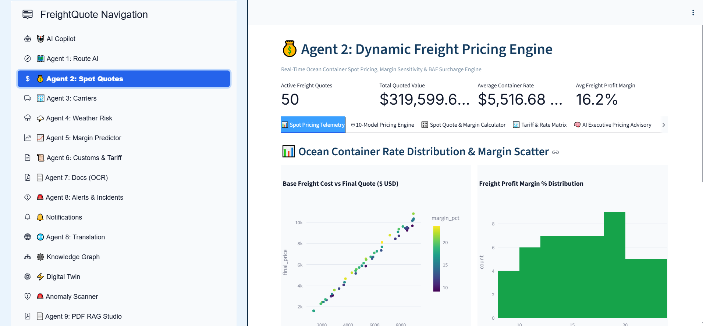 | 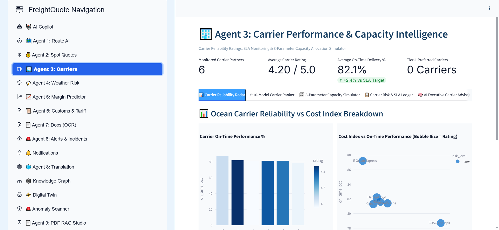 |

| Agent 4: Weather Risk | Agent 5: Margin Optimizer | Agent 6: Customs & Compliance |
|---|---|---|
| 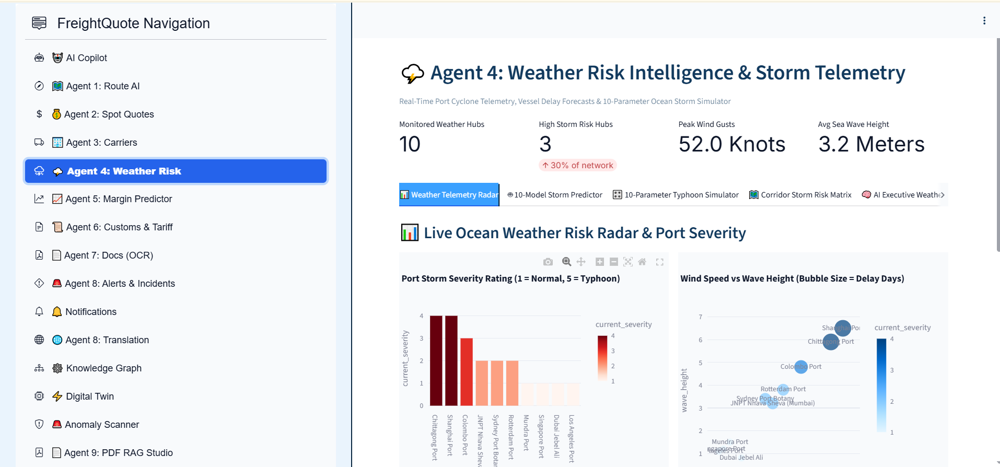 | 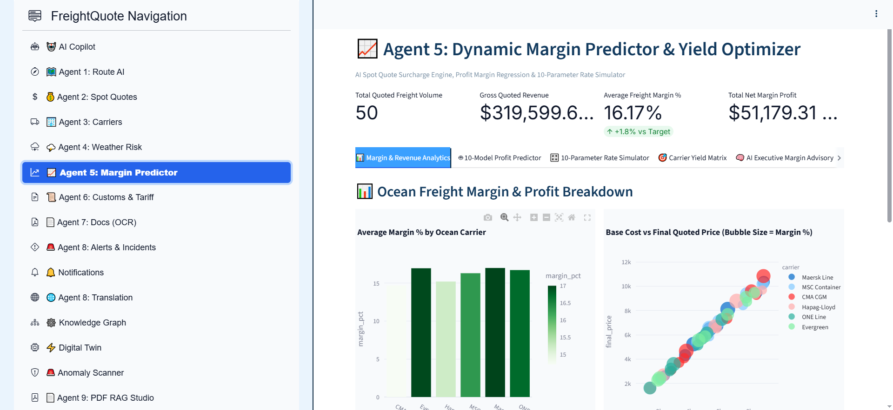 | 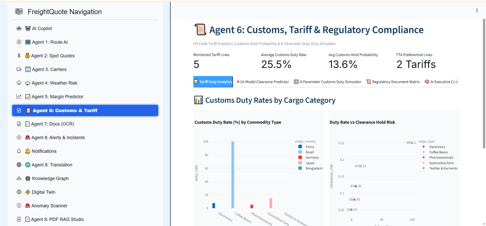 |

| Agent 7: Docs & Bill of Lading (OCR) | Agent 8: Translation | Agent 9: PDF RAG Studio |
|---|---|---|
| 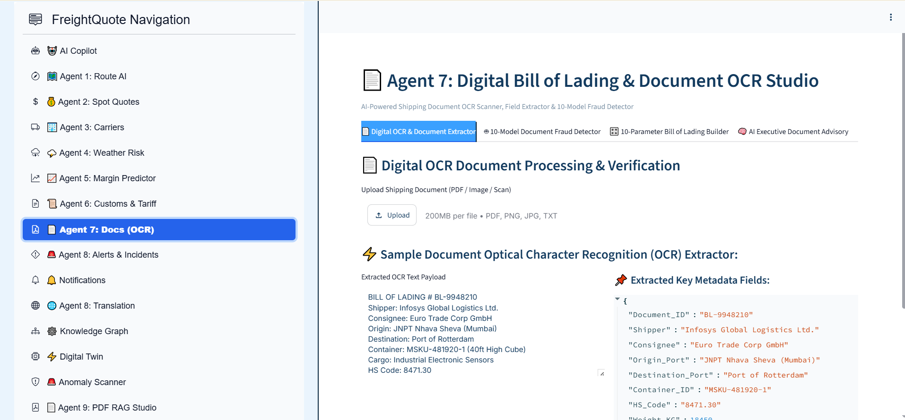 | 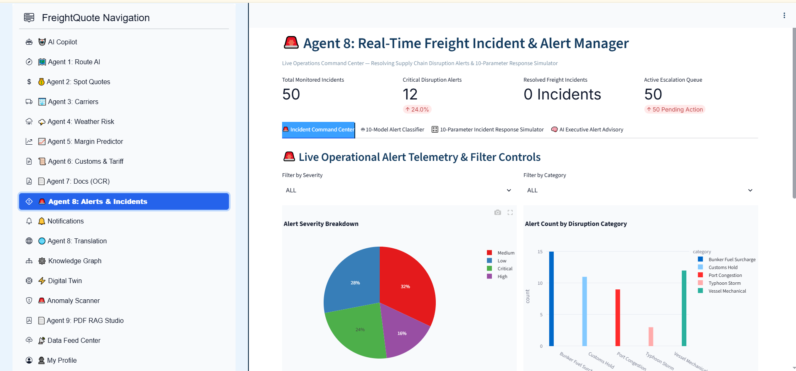 | 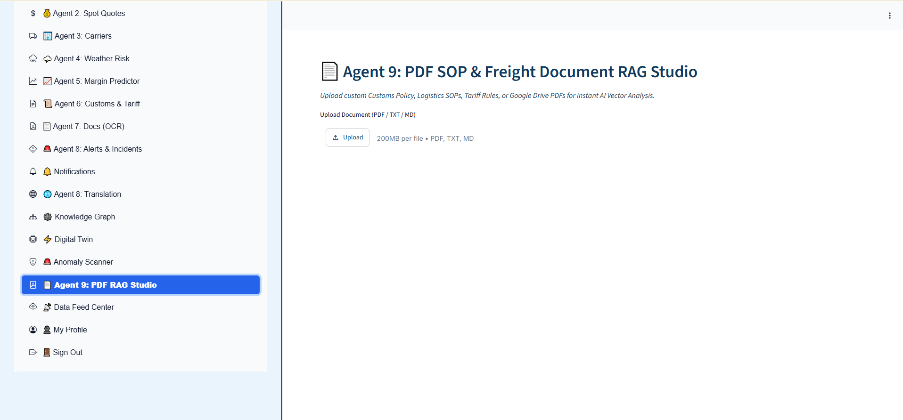 |

---

## 📦 requirements.txt

Current dependency list (see file for the live version):

```
streamlit>=1.36
streamlit-option-menu>=0.3.13
streamlit-folium>=0.22
deep-translator>=1.11
transformers>=4.41
torch>=2.2
sentencepiece>=0.2.0
accelerate>=0.30
pdfplumber>=0.11
reportlab>=4.0
fpdf>=1.7
bcrypt>=4.0
flask>=3.0
plotly>=5.20

---

## 🔑 Environment Variables & Security

### Required Environment Variables (names only — never commit real values)

| Variable | Purpose | Where to get it |
|---|---|---|
| `HF_TOKEN` | Hugging Face access token to download Qwen2.5 model weights | huggingface.co → Settings → Access Tokens |
| `KAGGLE_USERNAME` / `KAGGLE_KEY` | Kaggle API credentials, if any dataset is pulled via the Kaggle API | kaggle.com → Account → Create New API Token |
| `OTP_EMAIL_ADDRESS` (`EMAIL_ID`) | Sending mailbox for OTP emails | A dedicated project/team mailbox, not a personal one |
| `OTP_EMAIL_APP_PASSWORD` (`EMAIL_PASSWORD`) | Gmail App Password (NOT the real account password) for SMTP send | Google Account → Security → App Passwords, with 2FA enabled |
| `JWT_SECRET_KEY` | Signing key for session tokens | Generate locally: `python -c "import secrets;print(secrets.token_hex(32))"` |
| `ADMIN_EMAIL_ID` / `ADMIN_PASSWORD` | Seeded admin account credentials | Set your own values before first run |

### What must NEVER appear in the README, code, notebooks, or commit history

- Real Hugging Face or Kaggle tokens
- A real Gmail account's actual login password (use an **App Password**, and still keep it out of the repo)
- Any `.env` file with real values — only `.env.example` with empty/placeholder values is committed
- Database dumps containing real personal data

> ⚠️ If a token or password is ever accidentally committed, treat it as compromised: **revoke/rotate it immediately** (delete & regenerate Hugging Face/Kaggle tokens; revoke the Google App Password) — deleting the line in a later commit is not enough, since it remains in git history.

### Practical Setup for OTP Email Sending

1. Create a dedicated Gmail account for the project (not anyone's personal account).
2. Enable 2-Step Verification on that account.
3. Generate a 16-character **App Password** for it.
4. Store `OTP_EMAIL_ADDRESS` and `OTP_EMAIL_APP_PASSWORD` only in `.env` locally, and as GitHub Actions/Colab **Secrets** if run in CI or shared notebooks.
5. Add `.env` to `.gitignore` **before the first commit** — verify with: `git check-ignore -v .env`

---

## ⚠️ Known Limitations & Future Scope

### Known Limitations
- Uses **synthetic/seeded data** for ports, carriers, and shipments rather than live commercial freight data (except Agent 4's live Open-Meteo weather feed).
- **Single-tenant** design — no multi-organization data isolation yet.
- Uses **SQLite** rather than a production-grade database, which limits concurrent-write scalability.
- `requirements.txt` currently uses floating version ranges rather than pinned versions (see note above).

### Future Scope
- Integrate live freight-market rate feeds and real carrier APIs.
- Migrate to a production database (e.g. PostgreSQL) for multi-user concurrency.
- Add multi-tenant organization support with per-org data isolation.
- Expand the RAG knowledge base (Agent 9) to auto-refresh from a shared document repository instead of manual uploads only.

---

## 👥 Program & Team Context

**Program:** Infosys Springboard Internship — Batch 1

**Mentor:** `[Add Mentor's Full Name & Designation]`

| Name | Role / What They Built | GitHub Handle |
|---|---|---|
| Sriharsha Thorupunuri | GitHub repository management & frontend development | `[Add GitHub handle]` |ssssss
| Yuvanesh | Frontend development of the Streamlit application | `[Add GitHub handle]` |
| Nitya Balraj | Backend development — agents, database, auth & LLM integration | `[Add GitHub handle]` |
| Kavyashree | UI/UX design | `[Add GitHub handle]` |
| Sriharsha Thorupunuri | GitHub repository management & frontend development | `[Add GitHub handle]` |

---

## 📁 Suggested Repository Structure

```
freightquote-ai/
├── README.md                          ← this file (Overall README, repo root)
├── requirements.txt
├── .env.example                       ← variable NAMES only, no real values
├── .gitignore                         ← must include .env, *.db, __pycache__/, *.ipynb_checkpoints
├── docs/
│   ├── architecture-diagram.png
│   └── demo/demo.mp4                  ← or a link if the file is too large for GitHub
├── screenshots/
├── milestone-1/
│   └── README.md                      ← optional, milestone-specific
├── milestone-2/
├── app.py / streamlit_app.py
└── src/ ...
